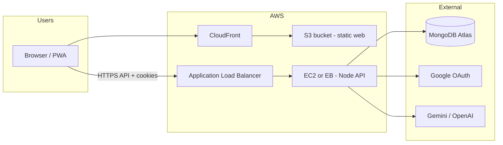

# HireBoost AI — End-to-end AWS hosting

This guide deploys the monorepo **as designed in the README**: static **PWA** on **S3 + CloudFront**, **Express API** behind **HTTPS** (EC2 or Elastic Beanstalk + ALB), and **MongoDB Atlas** for data. Secrets live in **AWS Secrets Manager** or **SSM Parameter Store**.

---


nothings just setting up EC2

## 1. What you are building



| Piece | Technology |
| ----- | ---------- |
| Frontend | `apps/web` → Vite build → **S3** + **CloudFront** |
| Backend | `apps/api` → `node dist/server.js` → **EC2** or **Elastic Beanstalk** behind **ALB** |
| Database | **MongoDB Atlas** (recommended) or AWS DocumentDB |
| TLS | **ACM** (certificate in `us-east-1` for CloudFront; same region as ALB for API) |
| DNS | **Route 53** (or any DNS → CloudFront / ALB) |

---

## 2. Domains (pick before you click around in AWS)

Example:

| Host | Points to | Purpose |
| ---- | --------- | ------- |
| `app.example.com` | CloudFront | React SPA + PWA |
| `api.example.com` | ALB | Express `API_PREFIX` (default `/api/v1`) |

Use **HTTPS everywhere**. The API sets **HttpOnly refresh cookies**; in production use **`COOKIE_SECURE=true`**.

---

## 3. MongoDB Atlas

1. Create a cluster (M0 is fine to start).
2. Database Access → user with read/write on your DB.
3. Network Access → allow **your API egress**:
   - Easiest: **0.0.0.0/0** temporarily, then tighten to Elastic IP / NAT IP / security model.
   - Or **VPC peering** / private endpoint (later).
4. Copy **connection string** → `MONGODB_URI` (replace `<password>`).

---

## 4. TLS certificates (ACM)

1. **CloudFront** (for `app.example.com`):
   - Request public cert in ACM in **`us-east-1`** (required for CloudFront).
   - Validate via DNS (Route 53 button is easiest).

2. **API ALB** (for `api.example.com`):
   - Request public cert in ACM in the **same region as the ALB** (e.g. `us-east-1`).

---

## 5. Backend (API) on AWS

The API entrypoint after build is:

```bash
# From repo root, after install + build
npm run build:api
# Runs: node apps/api/dist/server.js (via workspace "start")
```

It listens on **`PORT`** (default `4000`) and serves routes under **`API_PREFIX`** (default `/api/v1`). Health check: **`GET /api/v1/health`**.

### 5a. Application Load Balancer

1. Create **target group**: type **Instance** or **IP**, protocol **HTTP**, port **4000** (or whatever `PORT` you use).
2. Health check path: **`/api/v1/health`**, matcher **200**.
3. Create **ALB** (internet-facing), listener **HTTPS:443** with the **API ACM cert**.
4. Forward to the target group. Optional: HTTP → HTTPS redirect on port 80.

### 5b. Run the API on EC2 (minimal path)

1. **Launch EC2** (Amazon Linux 2023 or Ubuntu), Node **20+**.
2. **Security group**: allow **inbound 4000** (or only from ALB SG if instance is private — typical pattern: instance in private subnet, ALB in public subnets; target port 4000 from ALB SG only).
3. Install app (one approach):
   - Clone repo, `npm ci`, `npm run build` (or copy CI artifacts).
   - Set environment (see §7); use **Secrets Manager** / **SSM** for secrets, not plaintext on disk in production.
4. Process manager: **systemd** (example below) or **PM2**.

**systemd unit** (`/etc/systemd/system/hireboost-api.service`):

```ini
[Unit]
Description=HireBoost API
After=network.target

[Service]
Type=simple
User=ec2-user
WorkingDirectory=/opt/hireboost-ai
EnvironmentFile=/opt/hireboost-ai/apps/api/.env.production
ExecStart=/usr/bin/node apps/api/dist/server.js
Restart=on-failure
RestartSec=5

[Install]
WantedBy=multi-user.target
```

Register the app under `/opt/hireboost-ai` with `node_modules` installed and `packages/shared` built (full `npm run build` from repo root is simplest).

5. Register EC2 instance in the **target group** (or use Auto Scaling later).

### 5c. Elastic Beanstalk (alternative)

1. Create Node.js platform environment.
2. Bundle: `package.json` at root or use **Docker**; ensure **postinstall** or platform hook runs `npm run build` and **start command** runs `npm run start:api` from repo root (or `node apps/api/dist/server.js` with `cwd` set to repo root so workspace resolution works — **test locally first**).
3. Set env vars in EB console (or SSM).
4. Attach **ALB** with HTTPS + health **`/api/v1/health`**.

EB is finicky with **monorepos**; many teams use a **Dockerfile** that copies the repo and runs `npm ci && npm run build && node apps/api/dist/server.js`.

### 5d. Uploads (`UPLOAD_DIR`)

Default is **`./uploads`** on disk. On EC2, use an **EBS volume** mounted at a stable path and set **`UPLOAD_DIR`** there, or plan a follow-up to store files in **S3** (not implemented in this doc).

---

## 6. Frontend (PWA) — S3 + CloudFront

### 6a. Build (API URL is baked in at build time)

From repo root:

```bash
export VITE_API_BASE_URL="https://api.example.com/api/v1"
npm ci
npm run build:web
```

Artifacts: **`apps/web/dist/`** (HTML, JS, CSS, `manifest.webmanifest`, service worker, assets).

### 6b. S3

1. Create bucket (e.g. `hireboost-web-prod`), **Block Public Access ON** (CloudFront will use OAC).
2. Upload contents of **`apps/web/dist/`** (preserve structure; `index.html` at bucket root or under prefix — usually root).

### 6c. CloudFront

1. Create distribution; **Origin**: S3 with **Origin Access Control (OAC)**; grant bucket policy for CloudFront.
2. **Default root object**: `index.html`.
3. **SPA routing**: add **custom error responses**:
   - HTTP **403** → **200** → `/index.html` (and optionally **404** → **200** → `/index.html`) so React Router paths load the app.
4. **Alternate domain name (CNAME)**: `app.example.com`; attach **ACM cert (us-east-1)**.
5. **Behaviors**: default caches static assets; you may set longer TTL for hashed JS/CSS (Vite emits hashed filenames).

### 6d. DNS

Create **Route 53 A/AAAA alias** (or CNAME) for `app.example.com` → CloudFront distribution.

---

## 7. Environment variables (production)

### 7a. API (`apps/api` — set on EC2/EB/ECS)

| Variable | Example | Notes |
| -------- | ------- | ----- |
| `NODE_ENV` | `production` | Required for strict DB boot |
| `PORT` | `4000` | Must match target group |
| `API_PREFIX` | `/api/v1` | Default |
| `MONGODB_URI` | `mongodb+srv://...` | From Atlas |
| `MONGODB_DB_NAME` | `hireboost` | |
| `WEB_APP_URL` | `https://app.example.com` | OAuth redirect base / links |
| `CORS_ORIGINS` | `https://app.example.com` | Comma-separated; **exact** origin |
| `JWT_SECRET` | 32+ random bytes | |
| `JWT_REFRESH_SECRET` | different random | |
| `JWT_EXPIRES_IN` | `15m` | Access token TTL |
| `JWT_REFRESH_EXPIRES_IN` | `30d` | Refresh cookie TTL |
| `COOKIE_SECURE` | `true` | Production |
| `COOKIE_SAME_SITE` | `lax` | Use `none` only if cross-site + `Secure` |
| `COOKIE_DOMAIN` | *(omit)* | Set only if sharing cookies across subdomains |
| `LOG_PRETTY` | `false` | JSON logs for CloudWatch |
| `GEMINI_API_KEY` / `OPENAI_API_KEY` | | Per `AI_PROVIDER` |
| `GOOGLE_CLIENT_ID` / `GOOGLE_CLIENT_SECRET` | | If using Google sign-in |
| `GOOGLE_REDIRECT_URI` | `https://api.example.com/api/v1/auth/google/callback` | Must match Google Console |
| `UPLOAD_DIR` | `/data/uploads` | If using persistent disk |

Load secrets from **Secrets Manager** or **SSM** and export as env in systemd/EB — do not commit `.env`.

### 7b. Web (build-time only)

| Variable | Example |
| -------- | ------- |
| `VITE_API_BASE_URL` | `https://api.example.com/api/v1` |
| `VITE_APP_NAME` | `HireBoost AI` |
| `VITE_GOOGLE_CLIENT_ID` | *(optional, for any client-side Google UI)* |

Rebuild and redeploy the **web** bundle whenever the public API URL changes.

---

## 8. Google OAuth (if enabled)

1. [Google Cloud Console](https://console.cloud.google.com/) → APIs & Services → Credentials → OAuth 2.0 Client.
2. **Authorized redirect URIs**: `https://api.example.com/api/v1/auth/google/callback` (must match `GOOGLE_REDIRECT_URI`).
3. **JavaScript origins** (if needed): `https://app.example.com`.

---

## 9. Auth cookies + CORS checklist

- **SPA origin** must appear exactly in **`CORS_ORIGINS`** (scheme + host + port if any).
- **`WEB_APP_URL`** must be the **user-facing** app URL (`https://app.example.com`).
- Use **one hostname** consistently (`localhost` vs `127.0.0.1` breaks cookies in dev; same idea in prod — no mixed hosts).
- **`COOKIE_SECURE=true`** in production.

---

## 10. CI/CD (recommended pattern)

1. **GitHub Actions** (or CodePipeline):
   - On tag or `main`: `npm ci`, `npm run typecheck`, `npm run build`.
   - Build web with **`VITE_API_BASE_URL`** from GitHub secret.
   - Sync **`apps/web/dist`** to S3; **`aws cloudfront create-invalidation`**.
   - Package API: deploy to EB / push Docker image to ECR + ECS, or **SSM SendCommand** to pull + restart EC2.

2. Store **`MONGODB_URI`**, **`JWT_*`**, AI keys in **Secrets Manager**; IAM role for compute reads them at boot.

---

## 11. Post-deploy verification

```bash
curl -sS https://api.example.com/api/v1/health
# Expect JSON success

open https://app.example.com
# Sign up / log in; confirm API calls in Network tab go to api.example.com with 200s
```

Check browser **Application → Cookies** for refresh cookie on **API host** after login (behavior depends on same-site setup).

---

## 12. Cost-conscious minimal stack

- Atlas **M0**, one **t3.small** EC2 (or single-instance EB), one **ALB**, **S3** + **CloudFront** with low traffic: typically **tens of USD/month** excluding outbound data and AI API usage.

---

## 13. Troubleshooting

| Symptom | Likely cause |
| ------- | ------------ |
| SPA 404 on refresh | CloudFront / S3 not rewriting to `index.html` |
| CORS errors | `CORS_ORIGINS` missing exact frontend origin |
| Login drops / no refresh | `COOKIE_SECURE`, wrong domain, or `localhost`-style mismatch |
| API won’t boot | `MONGODB_URI` / network to Atlas; `NODE_ENV=production` + DB down exits process |

---

## 14. References in this repo

- Root build: `npm run build` (shared → api → web)
- API start: `npm run start:api`
- Web preview locally: `npm run preview:web`
- Env schema: `apps/api/src/config/env.ts`, `apps/web/src/lib/env.ts`
